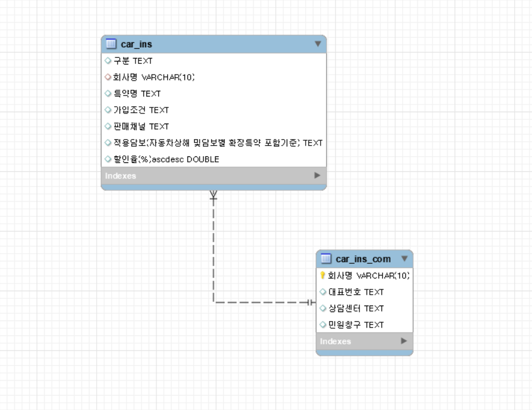

# SKN13-1ST-4TEAM
SK 네트웍스 AI과정 1차 프로젝트

--- 

## Team 소개
**👋🏻 팀명: (기입예정)**  

**👋🏻 팀원**:  

<table>
  <tr>
    <th>박현아</th>
    <th>안수민</th>
    <th>우민규</th>
    <th>이재범</th>
    <th>최호연</th>
  </tr>  
  <tr>
    <td></td>
    <td></td>
    <td></td>
    <td>
", width = 100/></td>
    <td>
</td>
  </tr>  
</table>
<!-- | 박현아 | 안수민 | 우민규 | 이재범 | 최호연 |
|--------|--------|--------|--------|--------| -->

--- 

# 🚗 자동차보험 특별 약관 정보 비교 시스템

## 📌 프로젝트 소개

자동차보험 특별 약관 정보를 보험사별 또는 특별 약관 유형형별로 정리하여, 사용자가 보험 선택을 보다 쉽고 효율적으로 할 수 있게 도와주는 서비스입니다.

## 💡 프로젝트 필요성 (배경)

자동차보험 특별 약관의 가입 조건과 할인율은 보험사마다 유사하지만 조금씩 차이가 존재합니다. 이러한 내용을 각 보험사 홈페이지를 방문해 일일이 확인하는 것은 사용자에게 번거롭고 불편한 작업입니다.\
이에 필요한 정보를 한 사이트에서서 비교할 수 있도록 정리함으로써, 사용자의 보험 선택을 용이하게 하는 서비스를 제안하게 되었습니다.

## 🎯 프로젝트 목표

자동차보험의 특별 약관 내용을 보험사 및 할인 유형별로 구분하여 정리하고, 할인율을 한눈에 비교할 수 있도록 함으로써, 사용자의 보험 선택 과정에 실질적인 도움을 주는 것입니다.

## ✅ 세부 목표

1️⃣ **보험사별 할인 특별 약관 항목 분류**

- 11개 주요 보험사별로 제공되는 할인 특약 항목 정리

2️⃣ **할인 특별 약관 유형별 정리**

- 자녀할인, 블랙박스할인, 마일리지할인인 등 6가지 주요 특약 유형별로 정리

3️⃣ **사용자 비교 편의성 강화**

- 특약 및 보험사별 실제 가입 조건, 유의사항, 할인율 등을 표 형태로 정리하여 직관적인 비교 지원

4️⃣ **정보의 신뢰성 확보**

- 각 보험사의 공식 대표번호 및 상담센터/민원창구 링크를 함께 제공하여 공신력 있는 정보 제공

---

## Tech Stack (기술 스택)

### 📋 WBS

| **작업 명**                | **시작일** | **종료일** | **담당자**                | **산출물**             | 
| ------------------------- | ---------- | ---------- | ------------------------ | ---------------------- | 
| 프로젝트 주제 선정        | 04-09      | 04-09      | ALL                      |                  | 
| 자동차보험 특약 크롤링        | 04-09      | 04-09      | ALL                      | csv                   | 
| 데이터 전처리        | 04-09      | 04-10      | 안수민, 우민규                      | csv                   | 
| Streamlit 화면 설계        | 04-09      | 04-10      | 이재범, 최호연           | 설계파일, WEB 화면     | 
| Streamlit-DB연동           | 04-09      | 04-09      | 이재범, 최호연                    | DB table               | 
| 보험사 정보 수집        | 04-09      | 04-10      | ALL                      | csv       
| 데이터-DB연동              | 04-10      | 04-10      | 박현아, 안수민, 우민규   | ERD 다이어그램         | 
| ERD 작성             | 04-10      | 04-10      | 박현아, 안수민, 우민규                      | DB 데이터             | 
| Streamlit 화면 구현        | 04-10      | 04-10      | 이재범, 최호연                      | Streamlit 화면         |
| 코드 취합                  | 04-10      | 04-10      | ALL                      | Web 페이지, DB 데이터  |
| 최종 점검                  | 04-10      | 04-10      | ALL                      | Web 페이지             |

### 💻 주요 기술
>###  구현
<table>
  <tr>
    <td></td>
    <td></td>
    <td></td>
  </tr>  
</table>

>###  페이지 설정 
<table>
  <tr>
    <td></td>
  </tr>
</table>

>###  데이터 수집 및 처리 
<table>
  <tr>
    <td></td>
    <td></td>
    <td></td>
    <td></td>
  </tr>
</table>
 
 

##  주요 기능

**🌟 보험사별 할인 특약 비교**  
- 각 보험사가 제공하는 할인 특약을 한눈에 비교할 수 있는 표 제공  
- 할인율, 적용 조건 등을 항목별로 정리  

**🌟 특약 유형별 정보 정리**  
- 유형별로 어떤 보험사에서 어떤 특약을 제공하는지 확인 가능  
- 할인율, 적용 조건 등을 항목별로 정리  

**🌟 각 보험사의 공식 채널 안내**  
- 대표번호, 상담센터 링크, 민원접수 창구 등 공식 연락처 제공  
- 정보 확인 또는 문의가 필요한 사용자를 위한 직접 경로 안내

###  주요 산출물  
**🏆 자동화된 데이터 수집 코드**  
   - Selenium 등을 활용해 보험사 웹사이트에서 할인 특약 정보를 수집  
      
**🏆 할인 특약 정리 문서**
   - 할인 항목, 조건, 할인율, 유의사항 등 구조화된 정보 포함  

**🏆 자동차 보험 할인 특약 비교 웹페이지**  
   - 수집한 내용을 기반으로 사용자가 쉽게 정보를 열람할 수 있는 인터페이스 제공  

**🏆 직관적인 웹 기반 대시보드**  
   - 사용자 친화적이고 직관적인 웹 대시보드 구현  

---

###  데이터베이스 (ERD)

---

###  요구사항 명세서

|**RQ-ID**|분류|요구사항명|요구사항 내용|날짜|
|------|---|---|---|---|
|RQ-01|DB|데이터 수집|국내 11개사의 특약명, 가입조건, 판매채널, 할인율 등을 포함한 데이터를 수집한다.|04/09|
|RQ-02|DB|DB 구축|수집한 데이터를 DB에 등록한다.|04/09|
|------|---|---|---|---|
|RQ-HOME-01|메인 페이지|화면 구축|보험사별 특약 구분 페이지, 특약 유형별 구분 페이지로 이동할 수 있는 버튼을 구축한다.|04/09|
|------|---|---|---|---|
|RQ-INS-01|특약 유형별 구분 페이지|화면 구축|특약 유형 -> 회사 순서로 특약 정보를 조회하는 페이지를 구축한다.|04/09|
|RQ-INS-02|특약 유형별 구분 페이지|네이버 포스트 불러오기|키워드를 입력하면 네이버 포스트를 불러오는 기능을 구축한다.|04/10|
|------|---|---|---|---|
|RQ-COM-01|보험사별 특약 구분 페이지|화면 구축|회사 -> 특약 유형 순서로 정보를 조회하는 페이지를 구축한다.|04/09|
|RQ-COM-02|보험사별 특약 구분 페이지|네이버 포스트 불러오기|키워드를 입력하면 네이버 포스트를 불러오는 기능을 구축한다.|04/10|

---

###  프로젝트 수행 결과

#### 🏠 Home
(사진)

#### 🏢 보험사별 할인 특별 약관 정리
(사진)

#### 📊 할인 특별 약관별 정리
(사진)

#### 혹시 뭐라도 들어가게 된다면,,,
(사진)

---

### 📌 한줄 회고

- **박현아**:  
  우다다

- **안수민**:

- **우민규**:  
  

- **이재범**:

- **최호연**:  

  
